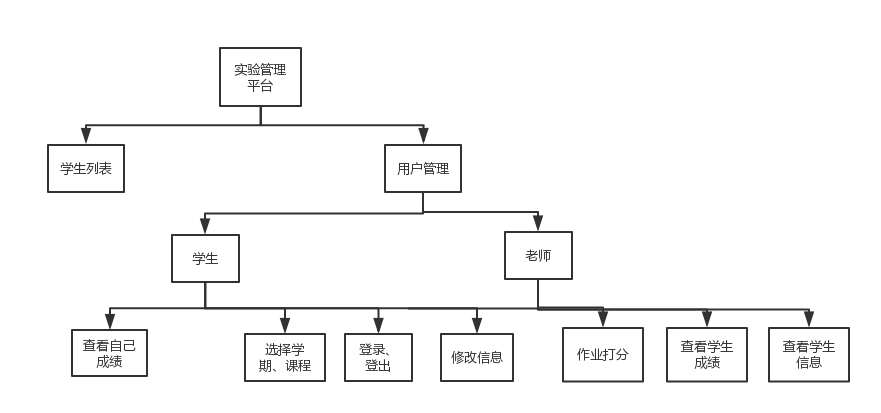
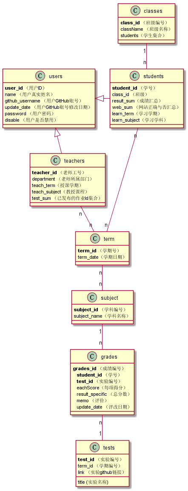

# 实验5：图书管理系统数据库设计与界面设计
|学号|班级|姓名|照片|
|:-------:|:-------------: | :----------:|:---:|
|201510414101|软件(本)15-1|安春生||

## 1. 概述
- 基于GitHub的实验管理平台的作用是在线管理实验成绩的Web应用系统。学生和老师的实验内容均存放在GitHUB
页面上。
- 学生的功能主要有：一是设置自己的GitHub用户名，二是查询自己的实验成绩。学生的GitHub用户名是公开的，但成绩不公开。
- 老师的功能主要有：一是批改每个学生的成绩，二是查看每个学生的成绩。
- 老师和学生都能通过本系统的链接方便地跳转到学生的每个GitHUB实验目录，以便批改实验或者查看实验情况。
- 实验成绩按数字分数计算，每项实验的满分为100分，最低为0分。
- 系统自动计算每个学生的所有实验的平均分。

## 2. 系统总体结构

界面设计参见：https://zwdbox.github.io/is_analysis/test6/ui/index.html

## 3. 用例图设计 [源码](src/usecase.puml)

## 4. 类图设计 [源码](src/class.puml)

## 5. 数据库设计
- ### USERS表（用户表）

    |字段|类型|主键，外键|可以为空|默认值|约束|说明|
    |:-------:|:-------------:|:------:|:----:|:---:|:----:|:----------|
    |USER_ID|NUMBER(8,0)|主键|否| | | 用户ID|
    |NAME|VARCHAR2(50 BYTE)| |否| | | 用户真实姓名|
    |GITHUB_USERNAME|VARCHAR2(50 BYTE)| |是|空| | GitHUB用户名|
    |UPDATE_DATE|DATE| |是|空| | GitHUB用户名修改日期|
    |PASSWORD|VARCHAR2(512 BYTE)| |是|空| | 加密存储密码，为空表示密码就是学号|
    |DISABLE|VARCHAR2(20 BYTE)| |否| | |是否禁用,值为是表示禁用,其他表示正常.|

- ### TEACHERS表（老师表）

    |字段|类型|主键，外键|可以为空|默认值|约束|说明|
    |:-------:|:-------------:|:------:|:----:|:---:|:----:|:----------|
    |TEACHER_ID|VARCHAR2(50 BYTE)|主键|否| | | 老师的编号|
    |USER_ID|NUMBER(8,0)|外键|是| | | 老师的用户ID，USERS表的外键|
    |DEPARTMENT|VARCHAR2(400 BYTE)| |否| | | 老师属于的部门|
    |TEACH_TERM|VARCHAR2(400 BYTE)| |是| | | 老师授课的学期|
    |TEACH_SUBJECT|VARCHAR2(400 BYTE)| |是| | | 老师教授的课程|

- ### STUDENTS表（学生表）

    |字段|类型|主键，外键|可以为空|默认值|约束|说明|
    |:-------:|:-------------:|:------:|:----:|:---:|:----:|:----------|
    |STUDENT_ID|VARCHAR2(50 BYTE)|主键|否| | | 学生的学号|
    |USER_ID|NUMBER(8,0)|外键|是| |空| 学生的用户ID，USERS表的外键，为空表示还没有建立用户|
    |CLASS_ID|VARCHAR2(20 BYTE)|外键|否| | | 班级编号|
    |RESULT_SUM|VARCHAR2(400 BYTE)|外键|是|空| | 成绩汇总（来自GRADES表），以逗号分开，第一个成绩是平均成绩,后面是每次实验的成绩，每次实验的成绩包含一个总成绩和各项评分的成绩，N表示未批改，平均分只计算已批改的。比如：“81.25,70,80,85,90,N”表示一共批改了4次，第5次未批改，4次的成绩分别是81.25,70,80,85,90,N，4次的平均分是81.25|
    |WEB_SUM|VARCHAR2(400 BYTE)| |是|空| | GitHub网址是否正确，用逗号分开，Y代表正确，N代表不正确。第1位代表总的GitHUB地址是否正确，第2位表示第1次实验的地址，第3位表示第2位实验地址，依此类推。比如：“Y,Y,Y,Y,Y,N”表示第5次实验地址不正确，其他地址正确|
    |LEARN_TERM|VARCHAR2(400 BYTE)| |是| | | 学生修课的学期|
    |LEARN_SUBJECT|VARCHAR2(400 BYTE)| |是| | | 学生学习的科目|

- ### TERM表（学生表）

    |字段|类型|主键，外键|可以为空|默认值|约束|说明|
    |:-------:|:-------------:|:------:|:----:|:---:|:----:|:----------|
    |TERM_ID|VARCHAR2(50 BYTE)|主键|否| | | 学期的编号|
    |TERM_NAME|VARCHAR2(100 BYTE)| |否| | | 学期的名称|

- ### SUBJECT表（学生表）

    |字段|类型|主键，外键|可以为空|默认值|约束|说明|
    |:-------:|:-------------:|:------:|:----:|:---:|:----:|:----------|
    |SUBJECT_ID|VARCHAR2(50 BYTE)|主键|否| | | 学科的编号|
    |SUBJECT_NAME|VARCHAR2(100 BYTE)| |否| | | 学科的名称|

- ### CLASSES表（班级表）

    |字段|类型|主键，外键|可以为空|默认值|约束|说明|
    |:-------:|:-------------:|:------:|:----:|:---:|:----:|:----------|
    |CLASS_ID|VARCHAR2(50 BYTE)|主键|否| | | 班级的编号|
    |CLASS_NAME|VARCHAR2(100 BYTE)| |否| | | 班级的名称|
    |STUDENTS|VARCHAR2(100 BYTE)| |否| | | 学生的集合|

- ### GRADES表（学生实验成绩表）

    |字段|类型|主键，外键|可以为空|默认值|约束|说明|
    |:-------:|:-------------:|:------:|:----:|:---:|:----:|:----------|
    |STUDENT_ID|VARCHAR2(50 BYTE)|联合主键1，外键|否| | | 学生的学号，STUDENTS表外键|
    |TEST_ID|NUMBER(6,0)|联合主键2，外键|否| | | 实验编号，TESTS表的外键|
    |RESULT_SUM|NUMBER| |是|空| 取值0-100| 总分数，这个值为空表示没有批改|
    |MEMO|VARCHAR2(400 BYTE)| |是|空| | 老师对实验的评语|
    |UPDATE_DATE|DATE| |是|空| |老师批改实验的日期，为空表示未批改|
    |EACH_SCORE|VARCHAR2(400 BYTE)| |是|空| | 每个实验的每项考点分数|

- ### TESTS表（实验项目表）

    |字段|类型|主键，外键|可以为空|默认值|约束|说明|
    |:-------:|:-------------:|:------:|:----:|:---:|:----:|:----------|
    |TEST_ID|NUMBER(6,0)|主键|否| | | 实验编号|
    |TITLE|VARCHAR2(100 BYTE)| |否| | | 实验名称|

## 6. 用例及界面详细设计

- ### [“选择学期”用例](./选择学期用例.md)
- ### [“选择课程”用例](./选择课程用例.md)
- ### [“学生作业列表”用例](./学生作业列表用例.md)
- ### [“学生查看成绩”用例](./学生查看成绩用例.md)
- ### [“学生、老师修改信息”用例](./学生、老师修改信息用例.md)
- ### [“选择班级”用例](./选择班级用例.md)
- ### [“查看学生列表”用例](./查看学生列表用例.md)
- ### [“学生作业打分”用例](./学生作业打分用例.md)
- ### [“老师发布作业链接”用例](./老师发布作业链接用例.md)
