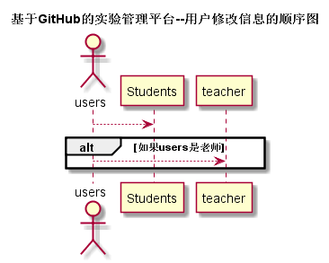

# “学生、老师修改信息”用例 [返回](./README.md)
## 1. 用例规约

|用例名称|学生、老师修改信息用例|
|-------|:-------------|
|功能|学生、老师可自主修改自己的密码、git地址等相关信息|
|参与者|老师|
|前置条件|用户已登录|
|后置条件| |
|主流事件| |
|备注| |

## 2. 业务流程（顺序图） [源码](./src/userModify.puml)
 

## 3. 界面设计
界面参照: https://acs121.github.io/is_analysis/test6/index.html

## 4. 算法描述（活动图）

- NAME和GITHUB_USERNAME解析为字符串。
  - 前台将个人信息修改设置为弹出框，点击个人信息时弹出。其中NAME和GITHUB_USERNAME显示在输入框中，并设置旧密码和新密码的文本框和一个“修改”按钮。用户可以在输入框中改变原有的字符。修改密码则需要输入原来的密码，默认为用户名，最后点击提交则表示修改信息。

## 5. 参照表

- students
- teachers
## 6. API接口设计

- 接口名称：modifiedImformation
    
- 功能：
    学生、老师可以在登录网站之后自己修改自己的相关信息。+   
    
    该接口服务于：http://202.115.82.8:1522
    
- API请求地址： 
    http://202.115.82.8:1522/v1/api/modifiedImformation

- 请求方式 ：
    GET  

- 请求参数说明:        
    请求参数为：userId，userId参数为用户Id确定用户信息，然后在查找用户信息。
    
- 返回实例：

        {
            "status": true,
            "name"："张三",
            "github_username":"acs121676"
        }
  
- 返回参数说明：    
 
  |参数名称|说明|
  |:---------:|:--------------------------------------------------------|      
  |status|bool类型，true表示正确的返回，false表示有错误|
  |name|字符类型，为用户在本系统的用户名|
  |github_username|字符类型，为本系统的关联网站github的用户名|