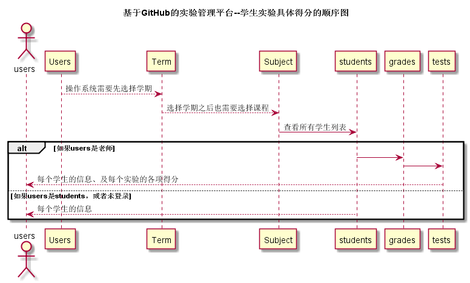

# “学生查看具体成绩”用例 [返回](./README.md)
## 1. 用例规约

|用例名称|学生查看具体成绩|
|-------|:-------------|
|功能|学生、老师能查看到每次实验的具体成绩及各个得分项|
|参与者|学生、老师|
|前置条件|已选择学期及课程，且进入到具体的某个用户|
|后置条件| |
|主流事件| |
|备注| |

## 2. 业务流程（顺序图） [源码](./src/lookSpecificScore.puml)
 

## 3. 界面设计
界面参照: https://acs121.github.io/is_analysis/test6/index.html

## 4. 算法描述（活动图）

- RESULT_SPECIFIC解析为列表。
  - RESULT_SPECIFIC为接口getStudentSpecificGrades的返回值，返回值为数组，数组元素为单项成绩打分要求与具体得分，前台直接根据列表显示数据，在列表之后显示作业评价。

## 5. 参照表

- students
- subject
- term
- grades
## 6. API接口设计

- 接口名称：getStudentSpecificGrades
    
- 功能：
    通过成绩id查询成绩表中的具体各项得分。
    
    该接口服务于：http://202.115.82.8:1522
    
- API请求地址： 
    http://202.115.82.8:1522/v1/api/getStudentSpecificGrades

- 请求方式 ：
    GET  

- 请求参数说明:        
    请求参数为：gradesId，通过grades查找具体的得分项数据。
    
- 返回实例：

        {
            "status": true,
            "result_specific"：{
                ["程序UI界面",20]
                ["程序可运行度",40]
                ["程序代码复杂度",20]
            }
        }
  
- 返回参数说明：    
 
  |参数名称|说明|
  |:---------:|:--------------------------------------------------------|      
  |status|bool类型，true表示正确的返回，false表示有错误|
  |result_specific|数组类型，数组中第一个值表示单项打分的要求，第二个值为单项得分|