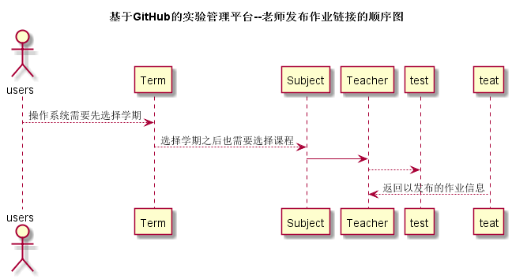

# “老师发布作业链接”用例 [返回](./README.md)
## 1. 用例规约

|用例名称|老师发布作业链接用例|
|-------|:-------------|
|功能|显示老师已发布在本课程的作业，并课添加新的课程作业|
|参与者|老师|
|前置条件|老师已选择学期、选择课程|
|后置条件| |
|主流事件| |
|备注| |

## 2. 业务流程（顺序图） [源码](./src/teacherPublishWorks.puml)
 

## 3. 界面设计
界面参照: https://acs121.github.io/is_analysis/test6/index.html

## 4. 算法描述（活动图）

- TEST_SUM解析为卡片块。
  - TEST_SUM为接口getTeacherExitTest的返回值，返回值为数组，作业名称显示在卡片上，并把作业链接添加在卡片上，
  每个卡片下边还增加按钮“批阅”，点击批阅按钮进入学生作业打分页面。

  该页面还设置添加按钮的卡片，点击添加弹出模态框，其中有两个输入框，一个为作业名称，另一个为作业链接，以及一个班级选择的下拉表单，选择班级表示把作业发布给该班级。

## 5. 参照表

- teachers
- subject
- term
- test

## 6. API接口设计

- 接口名称：getTeacherExitTest
    
- 功能：
    返回老师发布问题给予的班级名称列表。   
    
    该接口服务于：http://202.115.82.8:1522
    
- API请求地址： 
    http://202.115.82.8:1522/v1/api/getTeacherExitTest

- 请求方式 ：
    GET  

- 请求参数说明:        
    请求参数为：userId，userId参数为用户Id确定用户信息，根据老师信息返回testId集合。
    
- 返回实例：

        {
            "status": true,
            "test_sum"：{
                [101,"c实现回文函数reverse（）"，"https://github.com/zwdbox/is_analysis/tree/master/test1"],
                [102,"c语言指针练习","https://github.com/zwdbox/is_analysis/tree/master/test2"],
                [103,"c语言综合程序设计","https://github.com/zwdbox/is_analysis/tree/master/test3"]
            }
        }
  
- 返回参数说明：    
 
  |参数名称|说明|
  |:---------:|:--------------------------------------------------------|      
  |status|bool类型，true表示正确的返回，false表示有错误|
  |test_sum|数组类型，数组元素第一个表示作业的Id，第二个值表示该作业的名称,第三个值为作业的链接|