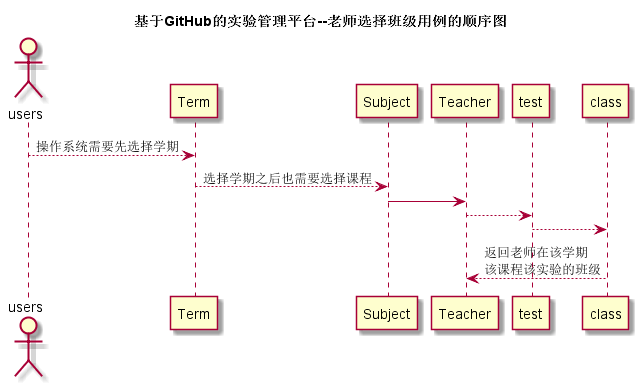

# “选择班级”用例 [返回](./README.md)
## 1. 用例规约

|用例名称|选择班级|
|-------|:-------------|
|功能|老师评阅要选择班级|
|参与者|老师|
|前置条件|进入主页且已选择发布的作业题目|
|后置条件| |
|主流事件| |
|备注| |

## 2. 业务流程（顺序图） [源码](./src/chooseClass.puml)
 

## 3. 界面设计
界面参照: https://acs121676.github.io/is_analysis/test6/ui/index.html
## 4. 算法描述（活动图）

- CLASSES解析为卡片块。
  - CLASSES为接口chooseClass的返回值，返回值为数组，数组元素为班级名称，前台直接根据元素进行UI显示。

## 5. 参照表

- students
- teachers
- subject
- term
## 6. API接口设计

- 接口名称：chooseClass
    
- 功能：
    返回老师发布问题给予的班级名称列表。   
    
    该接口服务于：http://202.115.82.8:1522
    
- API请求地址： 
    http://202.115.82.8:1522/v1/api/chooseClass

- 请求方式 ：
    GET  

- 请求参数说明:        
    请求参数为：userId、termId、testId，userId参数为用户Id确定用户信息，以便后台查找该用户的相关数据信息。termId确定学期，testId确定
    作业，进一步筛选课程。
    
- 返回实例：

        {
            "status": true,
            "classes"：[
                "15级软件工程一班",
                "16级软件工程二班",
                "17级软件工程三班"
            ]
        }
  
- 返回参数说明：    
 
  |参数名称|说明|
  |:---------:|:--------------------------------------------------------|      
  |status|bool类型，true表示正确的返回，false表示有错误|
  |classes|数组类型，元素表示班级名称|